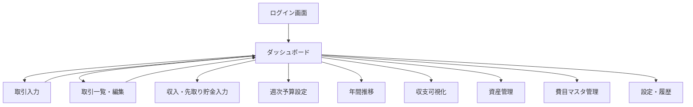
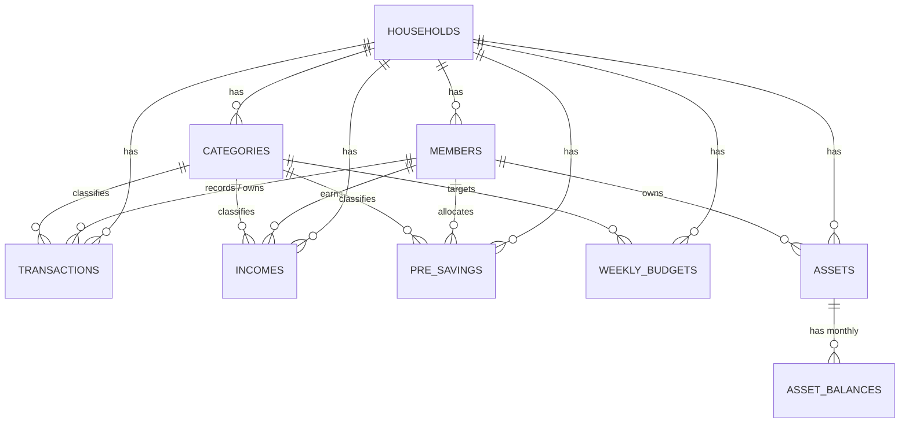

# 家計簿Webアプリ 基本設計書

- 版数：v0.1（ドラフト）
- 作成日：2026-08-13
- 関連文書：01_要件定義書.md

---

## 1. システム構成

### 1.1 全体構成図

```mermaid
graph LR
    subgraph クライアント
        A[ブラウザ<br/>PC / スマートフォン]
    end
    subgraph アプリケーションサーバー
        B[フロントエンド<br/>React + Vite]
        C[バックエンドAPI<br/>Node.js + Express or Fastify]
    end
    subgraph データ層
        D[(MySQL)]
    end
    subgraph 開発・運用
        E[VS Code]
        F[GitHub<br/>ソース管理/CI]
    end

    A -- HTTPS --> B
    B -- REST API / JSON --> C
    C -- SQL --> D
    E -- push/pull --> F
    F -- deploy --> C
```

### 1.2 技術スタック（提案）

| レイヤ | 技術候補 | 選定理由 |
|---|---|---|
| フロントエンド | React（Vite） + TypeScript | コンポーネント単位で月次シートのUIを分割しやすい。バイブコーディングとの相性が良く情報も豊富 |
| UIライブラリ | Tailwind CSS + 軽量チャートライブラリ（Chart.js等） | 円グラフ・棒グラフ・推移グラフを多用するため |
| バックエンド | Node.js（Express or Fastify）+ TypeScript、または Python（FastAPI） | どちらも情報量が多くAIコーディングと相性が良い。本書ではNode.js構成を基本とするが、開発者の得意言語に応じてFastAPI版に置換可能な設計とする |
| ORM | Prisma（Node.js）または SQLAlchemy（Python） | マイグレーション管理・型安全性のため |
| DB | MySQL 8.x | 要件で指定 |
| 認証 | JWT（アクセストークン）＋ bcryptによるパスワードハッシュ | 個人〜小規模利用に適したシンプルな方式 |
| バージョン管理 | GitHub（mainブランチ保護、feature branch運用） | 要件で指定 |
| 開発環境 | VS Code + Docker（MySQLコンテナ） | 環境差異の排除 |
| CI（任意） | GitHub Actions（lint / test） | 品質担保、将来拡張 |

> 補足：技術スタックは「MySQL・VS Code・GitHub」以外は開発者の裁量に委ねられているため、上記はAIバイブコーディングとの親和性を優先した提案。詳細設計書のAPI設計・テーブル定義はスタックに依存しない形で記述する。

---

## 2. 機能一覧（画面・API・DBの対応マップ）

| 機能ID | 機能名 | 主な画面 | 主なAPI | 主なテーブル |
|---|---|---|---|---|
| F01 | 認証 | ログイン画面 | POST /auth/login | users |
| F02 | 費目マスタ管理 | 費目マスタ管理画面 | /categories | categories |
| F03 | 取引入力 | 取引入力画面（支出/収入） | /transactions | transactions |
| F04 | 収入入力 | 月次収入入力画面 | /incomes | incomes |
| F05 | 先取り貯金・投資入力 | 月次先取り貯金入力画面 | /pre-savings | pre_savings |
| F06 | 週次予算管理 | 週次予算画面 | /weekly-budgets | weekly_budgets |
| F07 | 月次集計 | 月次ダッシュボード | /summary/monthly | transactions, incomes, pre_savings（集計） |
| F08 | 当月収支サマリ | 月次ダッシュボード | /summary/monthly/balance | 上記集計結果 |
| F09 | ダッシュボード | ダッシュボード画面 | 上記複合 | - |
| F10 | 年間推移 | 年間推移画面 | /summary/annual | transactions, incomes（集計） |
| F11 | 収支可視化（KPI） | 収支可視化画面 | /summary/visualization | 同上 |
| F12 | 資産管理 | 資産管理画面 | /assets, /asset-balances | assets, asset_balances |
| F13 | 変更履歴・操作ログ | 履歴画面 | /audit-logs | audit_logs |
| F14 | Excel移行 | 移行ツール（CLIまたは管理画面） | /import/excel | 全テーブル |
| F15 | エクスポート | 設定画面内 | /export | 全テーブル |

---

## 3. 画面一覧・画面遷移

### 3.1 画面一覧

| 画面ID | 画面名 | 概要 |
|---|---|---|
| SC01 | ログイン画面 | メールアドレス/パスワードでログイン |
| SC02 | ダッシュボード（月次） | 当月の収支サマリ・予算消化状況・費目別グラフを表示。アプリのトップ画面 |
| SC03 | 取引入力画面 | 支出・収入の1件入力（スマホ主動線） |
| SC04 | 取引一覧・編集画面 | 当月の取引をリスト表示、検索・編集・削除 |
| SC05 | 月次収入・先取り貯金入力画面 | 月初にまとめて入力する収入・先取り貯金/投資 |
| SC06 | 週次予算設定画面 | 変動費費目ごとの週次予算を設定 |
| SC07 | 年間推移画面 | 費目×月のクロス集計表とグラフ |
| SC08 | 収支可視化画面 | 月平均／年計のKPI（支出率・貯蓄率）表示 |
| SC09 | 資産管理画面 | 口座別月末残高の入力・推移確認 |
| SC10 | 費目マスタ管理画面 | 費目の追加・編集・並び替え・無効化 |
| SC11 | 設定・履歴画面 | 世帯メンバー管理、変更履歴、エクスポート |

### 3.2 画面遷移図



---

## 4. データモデル概要（ER図）

詳細なカラム定義は `03_詳細設計書.md` を参照。ここでは概念モデルのみ示す。



---

## 5. 集計ロジックの基本方針（Excel数式のアプリ化）

現行ExcelのSUMIFS・按分・比率計算は、以下の方針でアプリ側ロジック（サービス層／DBビュー）に置き換える。詳細は詳細設計書5章参照。

1. **取引の按分**：`transactions.split_type`（'self' / 'shared'）で管理し、集計時に `shared` は金額÷2を各メンバーに加算するクエリ／サービスロジックで実現（Excelの「両方」÷2をそのまま踏襲）。
2. **週次判定**：取引の`date`から「その月の第何週か（日曜始まり）」をアプリ側で計算し保存 or 都度算出する（Excelの`WEEKDAY`関数相当）。
3. **月次集計**：`transactions`・`incomes`・`pre_savings`をSQLの`GROUP BY`で人別・費目別に集計する（ExcelのSUMIFSに相当）。
4. **収支サマリ**：収入(a)・先取り貯金(b)・支出(c)を集計後、アプリ側で d=a-b-c、e=b+d を算出。
5. **比率計算**：支出率・貯蓄率は分母0の場合は0または「-」を返す（Excelの`IFERROR`相当をアプリ側で明示的にガード）。
6. **年間推移**：月次集計を12ヶ月分横持ちに変換して返すAPI（`GROUP BY category, month`）。

---

## 6. セキュリティ設計方針

- 全世帯データに`household_id`を持たせ、APIレイヤーで必ずログインユーザーの`household_id`と一致するデータのみ返却する（マルチテナント分離）。
- パスワードは bcrypt 等でハッシュ化して保存。平文保存は禁止。
- 通信はHTTPS必須（開発環境はローカルのみ許容）。
- APIはJWT等のトークン認証必須（認証不要なエンドポイントはログインのみ）。

## 7. 非機能設計方針

- ページ表示速度：月次ダッシュボードは主要クエリを集計用ビュー／インデックス設計で高速化（詳細設計書参照）。
- バックアップ：MySQLの`mysqldump`を日次実行しローカル/クラウドストレージに保管する運用を想定。
- ロギング：APIアクセスログ、および家計データの変更（作成・更新・削除）は`audit_logs`テーブルに記録。