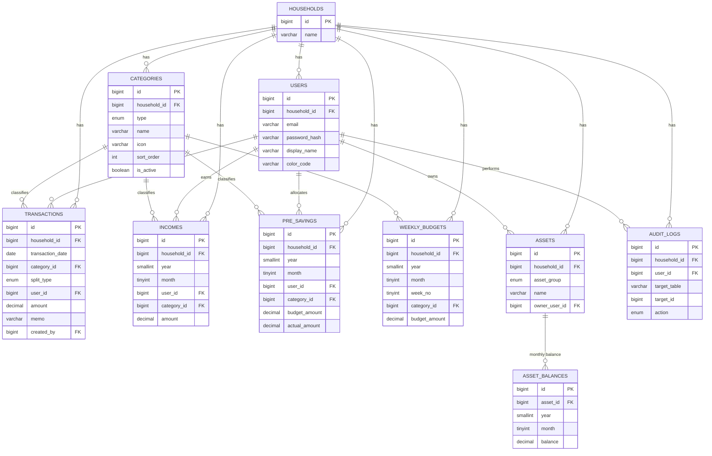

# 家計簿Webアプリ 詳細設計書

- 版数：v0.1（ドラフト）
- 作成日：2026-08-13
- 関連文書：01_要件定義書.md、02_基本設計書.md

---

## 1. テーブル定義書

命名規則：テーブル名・カラム名はスネークケース／英字。文字コードは `utf8mb4`（絵文字アイコン対応のため必須）。

### 1.1 households（世帯）

| カラム名 | 型 | PK/FK | NULL | 説明 |
|---|---|---|---|---|
| id | BIGINT UNSIGNED AUTO_INCREMENT | PK | NOT NULL | 世帯ID |
| name | VARCHAR(100) | | NOT NULL | 世帯名（例：たいよう・みらの家） |
| created_at | DATETIME | | NOT NULL | 作成日時 |
| updated_at | DATETIME | | NOT NULL | 更新日時 |

### 1.2 users（ログインユーザー）

| カラム名 | 型 | PK/FK | NULL | 説明 |
|---|---|---|---|---|
| id | BIGINT UNSIGNED AUTO_INCREMENT | PK | NOT NULL | ユーザーID |
| household_id | BIGINT UNSIGNED | FK→households.id | NOT NULL | 所属世帯 |
| email | VARCHAR(255) | UNIQUE | NOT NULL | ログインメールアドレス |
| password_hash | VARCHAR(255) | | NOT NULL | bcryptハッシュ |
| display_name | VARCHAR(50) | | NOT NULL | 表示名（例：たいよう） |
| color_code | VARCHAR(7) | | NULL | グラフ用カラー（例：#4A90D9） |
| created_at | DATETIME | | NOT NULL | 作成日時 |

> 現行Excelの「人」（たいよう／みらの）は`users`（＝`members`を兼ねる）で表現する。将来世帯人数が増減してもテーブル変更不要。

### 1.3 categories（費目マスタ）

| カラム名 | 型 | PK/FK | NULL | 説明 |
|---|---|---|---|---|
| id | BIGINT UNSIGNED AUTO_INCREMENT | PK | NOT NULL | 費目ID |
| household_id | BIGINT UNSIGNED | FK→households.id | NOT NULL | 所属世帯 |
| type | ENUM('income','pre_saving','fixed_expense','variable_expense') | | NOT NULL | 費目区分（収入／先取り貯金・投資／固定費／変動費） |
| name | VARCHAR(50) | | NOT NULL | 費目名（例：食費） |
| icon | VARCHAR(10) | | NULL | 絵文字アイコン（例：🍙） |
| sort_order | INT | | NOT NULL DEFAULT 0 | 表示順 |
| is_active | BOOLEAN | | NOT NULL DEFAULT TRUE | 論理削除フラグ |
| created_at | DATETIME | | NOT NULL | 作成日時 |

- UNIQUE制約：`(household_id, type, name)`
- 初期データ：現行費目マスタシートの全費目（2.3節参照）を投入。

### 1.4 transactions（取引明細＝支出・収入の生ログ）

現行の各月シート T〜Y列（支出明細）に相当。収入・先取り貯金は別テーブル（1.5, 1.6）で管理し、`transactions`は日々の支出のみを扱う（現行Excelの「支出 明細」テーブルに相当）。

| カラム名 | 型 | PK/FK | NULL | 説明 |
|---|---|---|---|---|
| id | BIGINT UNSIGNED AUTO_INCREMENT | PK | NOT NULL | 取引ID |
| household_id | BIGINT UNSIGNED | FK→households.id | NOT NULL | 所属世帯 |
| transaction_date | DATE | | NOT NULL | 取引日 |
| category_id | BIGINT UNSIGNED | FK→categories.id | NOT NULL | 費目（fixed_expense/variable_expense） |
| split_type | ENUM('self','shared') | | NOT NULL | 'self'＝入力者本人の支出、'shared'＝両方（折半） |
| user_id | BIGINT UNSIGNED | FK→users.id | NULL | split_type='self'の場合の対象者。'shared'の場合はNULL |
| amount | DECIMAL(10,0) | | NOT NULL | 金額（円） |
| memo | VARCHAR(255) | | NULL | 詳細メモ |
| created_by | BIGINT UNSIGNED | FK→users.id | NOT NULL | 入力者 |
| created_at | DATETIME | | NOT NULL | 作成日時 |
| updated_at | DATETIME | | NOT NULL | 更新日時 |

- INDEX：`(household_id, transaction_date)`、`(household_id, category_id)`
- 週番号は保存せず、`WEEK()`関数またはアプリ側で都度算出する（月initial日の曜日に依存するため、算出ロジックは5.2節参照）。
- 「両方」按分時の端数処理ルール：`amount`が奇数円の場合、集計時に本人側（先に登録した人、または`created_by`）に1円を寄せる。詳細は5.1節。

### 1.5 incomes（収入）

| カラム名 | 型 | PK/FK | NULL | 説明 |
|---|---|---|---|---|
| id | BIGINT UNSIGNED AUTO_INCREMENT | PK | NOT NULL | ID |
| household_id | BIGINT UNSIGNED | FK | NOT NULL | 所属世帯 |
| year | SMALLINT | | NOT NULL | 対象年 |
| month | TINYINT | | NOT NULL | 対象月（1-12） |
| user_id | BIGINT UNSIGNED | FK→users.id | NOT NULL | 収入を得た人 |
| category_id | BIGINT UNSIGNED | FK→categories.id | NOT NULL | 収入費目（type='income'） |
| amount | DECIMAL(10,0) | | NOT NULL DEFAULT 0 | 金額 |
| created_at | DATETIME | | NOT NULL | 作成日時 |
| updated_at | DATETIME | | NOT NULL | 更新日時 |

- UNIQUE制約：`(household_id, year, month, user_id, category_id)`

### 1.6 pre_savings（先取り貯金・投資）

| カラム名 | 型 | PK/FK | NULL | 説明 |
|---|---|---|---|---|
| id | BIGINT UNSIGNED AUTO_INCREMENT | PK | NOT NULL | ID |
| household_id | BIGINT UNSIGNED | FK | NOT NULL | 所属世帯 |
| year | SMALLINT | | NOT NULL | 対象年 |
| month | TINYINT | | NOT NULL | 対象月 |
| user_id | BIGINT UNSIGNED | FK→users.id | NOT NULL | 対象者 |
| category_id | BIGINT UNSIGNED | FK→categories.id | NOT NULL | 費目（type='pre_saving'） |
| budget_amount | DECIMAL(10,0) | | NOT NULL DEFAULT 0 | 予算額（現行I列相当、任意項目） |
| actual_amount | DECIMAL(10,0) | | NOT NULL DEFAULT 0 | 実績額（現行J列） |
| created_at | DATETIME | | NOT NULL | 作成日時 |

- UNIQUE制約：`(household_id, year, month, user_id, category_id)`

### 1.7 weekly_budgets（週次予算）

現行L13〜R45（週予算　管理）に相当。実績はtransactionsから都度集計するため、本テーブルは「予算額」のみ保持する。

| カラム名 | 型 | PK/FK | NULL | 説明 |
|---|---|---|---|---|
| id | BIGINT UNSIGNED AUTO_INCREMENT | PK | NOT NULL | ID |
| household_id | BIGINT UNSIGNED | FK | NOT NULL | 所属世帯 |
| year | SMALLINT | | NOT NULL | 対象年 |
| month | TINYINT | | NOT NULL | 対象月 |
| week_no | TINYINT | | NOT NULL | 週番号（1〜5） |
| category_id | BIGINT UNSIGNED | FK→categories.id | NOT NULL | 費目（type='variable_expense'） |
| budget_amount | DECIMAL(10,0) | | NOT NULL DEFAULT 0 | 週次予算額 |

- UNIQUE制約：`(household_id, year, month, week_no, category_id)`

### 1.8 assets（資産・口座マスタ）

現行「資産管理シート」の各行（名称・詳細・名義・用途・積立額）に相当。

| カラム名 | 型 | PK/FK | NULL | 説明 |
|---|---|---|---|---|
| id | BIGINT UNSIGNED AUTO_INCREMENT | PK | NOT NULL | 資産ID |
| household_id | BIGINT UNSIGNED | FK | NOT NULL | 所属世帯 |
| asset_group | ENUM('cash_deposit','securities','insurance') | | NOT NULL | 資産／証券・株式／保険の区分（現行の「資産」「証券」「保険」ブロック） |
| name | VARCHAR(100) | | NOT NULL | 名称（例：三井住友銀行） |
| detail | VARCHAR(100) | | NULL | 詳細（口座種別等） |
| owner_user_id | BIGINT UNSIGNED | FK→users.id | NOT NULL | 名義人 |
| purpose | VARCHAR(100) | | NULL | 用途 |
| monthly_contribution | DECIMAL(10,0) | | NULL | 積立額 |
| memo | VARCHAR(255) | | NULL | メモ |
| sort_order | INT | | NOT NULL DEFAULT 0 | 表示順 |
| is_active | BOOLEAN | | NOT NULL DEFAULT TRUE | 論理削除フラグ |

### 1.9 asset_balances（資産の月末残高）

| カラム名 | 型 | PK/FK | NULL | 説明 |
|---|---|---|---|---|
| id | BIGINT UNSIGNED AUTO_INCREMENT | PK | NOT NULL | ID |
| asset_id | BIGINT UNSIGNED | FK→assets.id | NOT NULL | 対象資産 |
| year | SMALLINT | | NOT NULL | 対象年 |
| month | TINYINT | | NOT NULL | 対象月 |
| balance | DECIMAL(12,0) | | NOT NULL DEFAULT 0 | 月末残高 |
| created_at | DATETIME | | NOT NULL | 作成日時 |

- UNIQUE制約：`(asset_id, year, month)`

### 1.10 audit_logs（変更履歴・操作ログ）

| カラム名 | 型 | PK/FK | NULL | 説明 |
|---|---|---|---|---|
| id | BIGINT UNSIGNED AUTO_INCREMENT | PK | NOT NULL | ID |
| household_id | BIGINT UNSIGNED | FK | NOT NULL | 所属世帯 |
| user_id | BIGINT UNSIGNED | FK→users.id | NOT NULL | 操作者 |
| target_table | VARCHAR(50) | | NOT NULL | 対象テーブル名 |
| target_id | BIGINT UNSIGNED | | NOT NULL | 対象レコードID |
| action | ENUM('create','update','delete') | | NOT NULL | 操作種別 |
| diff_json | JSON | | NULL | 変更差分 |
| created_at | DATETIME | | NOT NULL | 操作日時 |

---

## 2. ER図（詳細）



---

## 3. 画面詳細設計

### 3.1 SC03 取引入力画面（最重要・スマホ主動線）

| 項目 | 内容 |
|---|---|
| 入力項目 | 日付（デフォルト当日）／費目（type別にアイコン付きプルダウン、固定費/変動費を選択）／対象者（自分／相手／両方＝折半のトグル）／金額（テンキー入力）／メモ（任意） |
| バリデーション | 日付：必須、当年内。金額：必須、1円以上の整数。費目：必須 |
| 保存後の挙動 | トースト表示後、続けて次の取引を入力できるようフォームをリセット（連続入力を想定） |
| 現行対応 | 各月シートT〜Y列の1行入力に相当 |

### 3.2 SC02 ダッシュボード（月次）

| 項目 | 内容 |
|---|---|
| 表示内容 | ①当月収支サマリ（人別：収入a／先取り貯金b／支出c／余り貯金d／貯蓄合計e）②固定費・変動費の費目別内訳（円グラフ、人別タブ切替）③週次予算の消化状況（進捗バー、費目別）④直近取引一覧（5〜10件） |
| 年月切替 | 画面上部のセレクタで年・月を変更（現行の年月入力＋マクロ再計算に相当する処理をAPI呼び出しのみで実現） |
| 現行対応 | 各月シートのグラフ群＋B42:J45（当月収支）＋L13:R45（週予算） |

### 3.3 SC05 収入・先取り貯金入力画面

| 項目 | 内容 |
|---|---|
| 入力項目 | 対象年月／人別×費目別のマトリクス入力フォーム（収入5費目×2人、先取り貯金・投資4費目×2人） |
| 現行対応 | 各月シートB7:E16（収入）、G7:J14（先取り貯金・投資） |

### 3.4 SC06 週次予算設定画面

| 項目 | 内容 |
|---|---|
| 入力項目 | 対象年月／週（1〜5week、月の日数に応じ自動表示切替）／変動費費目ごとの予算額 |
| 表示項目 | 予算に対する実績（transactionsから自動集計）と差分を費目ごとに一覧表示 |
| 現行対応 | 各月シートL13:R45 |

### 3.5 SC07 年間推移画面

| 項目 | 内容 |
|---|---|
| 表示内容 | 費目（行）×月1〜12＋年間合計（列）のクロス集計テーブル、費目選択で推移折れ線グラフ表示 |
| 現行対応 | 年間推移シート |

### 3.6 SC08 収支可視化画面

| 項目 | 内容 |
|---|---|
| 表示内容 | 月平均の収支（人別）、年計（臨時収入・臨時支出込み）の収支、支出率・貯蓄率のKPIカード（目標値：支出率60%以下／貯蓄率40%以上を閾値として色分け表示） |
| 現行対応 | 収支可視化シート |

### 3.7 SC09 資産管理画面

| 項目 | 内容 |
|---|---|
| 入力項目 | 口座（資産）マスタの追加・編集、対象年月の月末残高入力 |
| 表示内容 | 資産グループ別（現金預貯金／証券株式／保険）×人別×合計の推移表、資産合計推移グラフ |
| 現行対応 | 資産管理シート |

### 3.8 SC10 費目マスタ管理画面

| 項目 | 内容 |
|---|---|
| 機能 | 費目の追加・名称編集・アイコン変更・並び替え（ドラッグ&ドロップ）・無効化（論理削除、使用中の費目は削除不可で無効化のみ） |
| 現行対応 | 費目マスタシート＋VBA「費目マスタ反映」マクロの代替 |

---

## 4. API設計（REST）

ベースパス：`/api/v1`。認証はBearerトークン（JWT）必須（`/auth/*`除く）。全APIは`household_id`をトークンから取得し、他世帯データへのアクセスを拒否する。

| メソッド | パス | 概要 | 主なリクエスト | 主なレスポンス |
|---|---|---|---|---|
| POST | /auth/login | ログイン | email, password | accessToken, user |
| GET | /categories | 費目一覧取得 | ?type= | Category[] |
| POST | /categories | 費目追加 | type, name, icon | Category |
| PUT | /categories/:id | 費目更新 | name, icon, sortOrder | Category |
| DELETE | /categories/:id | 費目無効化 | - | 204 |
| GET | /transactions | 取引一覧取得 | ?year=&month=&categoryId= | Transaction[] |
| POST | /transactions | 取引登録 | date, categoryId, splitType, userId, amount, memo | Transaction |
| PUT | /transactions/:id | 取引更新 | 同上 | Transaction |
| DELETE | /transactions/:id | 取引削除 | - | 204 |
| GET | /incomes | 収入取得 | ?year=&month= | Income[] |
| PUT | /incomes/bulk | 収入一括更新 | Income[] | Income[] |
| GET | /pre-savings | 先取り貯金取得 | ?year=&month= | PreSaving[] |
| PUT | /pre-savings/bulk | 先取り貯金一括更新 | PreSaving[] | PreSaving[] |
| GET | /weekly-budgets | 週次予算取得（実績付き） | ?year=&month= | WeeklyBudgetWithActual[] |
| PUT | /weekly-budgets/bulk | 週次予算一括更新 | WeeklyBudget[] | WeeklyBudget[] |
| GET | /summary/monthly | 月次集計（固定費/変動費/収支） | ?year=&month= | MonthlySummary |
| GET | /summary/annual | 年間推移 | ?year= | AnnualTrend |
| GET | /summary/visualization | 収支可視化KPI | ?year= | VisualizationSummary |
| GET | /assets | 資産一覧 | ?assetGroup= | Asset[] |
| POST | /assets | 資産追加 | name, detail, ownerUserId, assetGroup | Asset |
| GET | /asset-balances | 資産残高推移取得 | ?year= | AssetBalance[] |
| PUT | /asset-balances/bulk | 資産残高一括更新 | AssetBalance[] | AssetBalance[] |
| GET | /audit-logs | 変更履歴取得 | ?targetTable=&limit= | AuditLog[] |
| POST | /import/excel | 現行Excel取込 | multipart file | ImportResult |
| GET | /export | データエクスポート | ?format=csv|xlsx | file |

### 4.1 レスポンス例：GET /summary/monthly

```json
{
  "year": 2027,
  "month": 1,
  "members": [
    {
      "userId": 1,
      "displayName": "たいよう",
      "income": 300000,
      "preSaving": 50000,
      "fixedExpense": 80000,
      "variableExpense": 60000,
      "expense": 140000,
      "remainingSaving": 110000,
      "totalSaving": 160000
    },
    {
      "userId": 2,
      "displayName": "みらの",
      "income": 250000,
      "preSaving": 30000,
      "fixedExpense": 80000,
      "variableExpense": 60000,
      "expense": 140000,
      "remainingSaving": 80000,
      "totalSaving": 110000
    }
  ],
  "fixedExpenseByCategory": [
    {"category": "🔥💡光熱費", "たいよう": 8000, "みらの": 8000}
  ],
  "variableExpenseByCategory": [
    {"category": "🍙食費", "たいよう": 20000, "みらの": 20000}
  ]
}
```

---

## 5. 集計ロジック詳細（Excel数式のアプリロジック化）

### 5.1 「両方（折半）」の按分ロジック

現行Excel：`=SUMIFS(X6:X160, V6:V160, "たいよう", W6:W160, "🍙食費") + SUMIFS(X6:X160, V6:V160, "両方", W6:W160, "🍙食費")/2`

アプリでのSQL相当（例：MySQL）：

```sql
SELECT
  t.category_id,
  SUM(CASE WHEN t.split_type = 'self' AND t.user_id = :userId THEN t.amount ELSE 0 END)
  + SUM(CASE WHEN t.split_type = 'shared' THEN FLOOR(t.amount / 2) ELSE 0 END) AS amount_for_user
FROM transactions t
WHERE t.household_id = :householdId
  AND YEAR(t.transaction_date) = :year AND MONTH(t.transaction_date) = :month
GROUP BY t.category_id;
```

- 端数（奇数円）は`FLOOR(amount/2)`で切り捨てるため、2人分を合算すると1円の端数が残るケースがある。この端数は「入力者（`created_by`）側に1円加算する」ルールとし、サービス層で補正する（現行v1.2の「半端の額づつ支払った際の対応」を踏襲した明文化）。

### 5.2 週番号の算出ロジック

現行Excel：月初日を含む週を「日曜始まり」で第1週とし、`WEEKDAY`関数で計算。

アプリロジック（疑似コード）：
```
firstDayOfMonth = DATE(year, month, 1)
firstSunday = firstDayOfMonth - WEEKDAY(firstDayOfMonth, 'Sunday-start')
weekNo(date) = FLOOR((date - firstSunday) / 7) + 1  // 1〜5(6)
```
MySQLでは `WEEK(date, 0)` を用いて月初週との差分を取ることでも代替可能。どちらの方式でも、実装前に現行Excelの実値と突合テストを行うこと。

### 5.3 当月収支サマリ

```
income(a)        = SUM(incomes.amount WHERE user_id = X)
preSaving(b)      = SUM(pre_savings.actual_amount WHERE user_id = X)
expense(c)        = fixedExpense + variableExpense （5.1のロジックで人別按分済み）
remainingSaving(d) = a - b - c
totalSaving(e)     = b + d
```

### 5.4 比率計算（ゼロ除算ガード）

```
expenseRatio  = income == 0 ? 0 : (expense / income) * 100
savingRatio   = income == 0 ? 0 : (totalSaving / income) * 100
```
現行Excelの`IFERROR(...,0)`（第1.4版で追加）をアプリ側で標準実装とする。

### 5.5 年間推移

`GROUP BY category_id, MONTH(transaction_date)`（支出）および`incomes`側は`GROUP BY category_id, month`で12ヶ月分＋年間合計（SUM）を1レコードとして返す。

---

## 6. データ移行設計（既存Excelからの取込）

| 現行Excel | 移行先テーブル | 変換方針 |
|---|---|---|
| 費目マスタシート | categories | 収入/先取り貯金/固定費/変動費の各列を`type`ごとにパースし投入 |
| 各月シートB7:E16 | incomes | 費目名・人名でcategories/usersにマッピングして投入 |
| 各月シートG7:J14 | pre_savings | 同上（budget_amountは空欄扱い、actual_amountのみ投入） |
| 各月シートT6:Y159 | transactions | V列「たいよう/みらの」→split_type='self'+user_id、「両方」→split_type='shared'+user_id=NULL |
| 各月シートL16〜R45（予算行） | weekly_budgets | 週(1〜5week)×費目の予算値を抽出 |
| 資産管理シートC4:T15等 | assets, asset_balances | 名称/名義/用途等をassetsへ、I3:T列（年月ヘッダ）×行の値をasset_balancesへ展開 |
| 変更履歴シート | （移行不要） | アプリ自体の開発履歴はGitHubのコミット履歴・CHANGELOG.mdで管理 |

移行はワンショットのNode.jsスクリプト（`xlsx`または`exceljs`パッケージでExcelを読み込みDBへINSERT）として実装し、`/import/excel`APIまたはCLIどちらでも良い。移行後は必ず年間推移画面の合計値と現行Excelの年間推移シートの値を突合し、整合性を確認する。